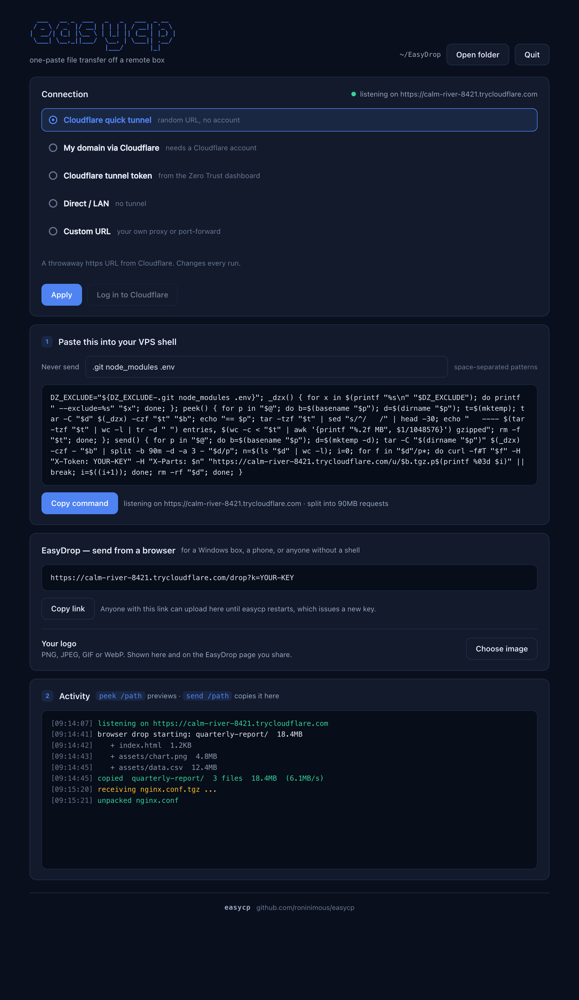
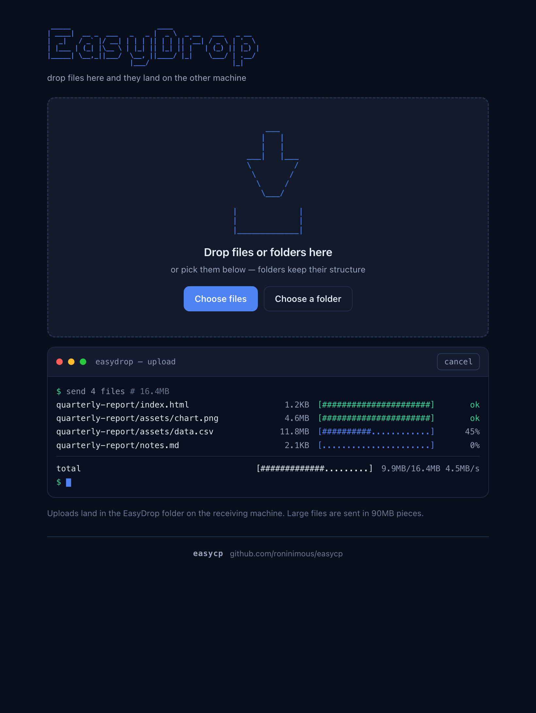
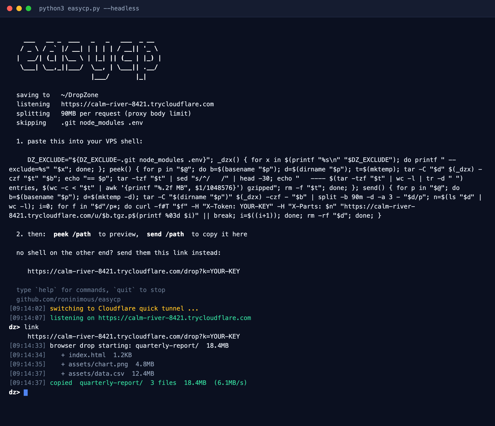

```
  ___   __ _  ___   _   _   ___  _ __
 / _ \ / _` |/ __| | | | | / __|| '_ \
|  __/| (_| |\__ \ | |_| || (__ | |_) |
 \___| \__,_||___/  \__, | \___|| .__/
                    |___/       |_|
```

**[github.com/roninimous/easycp](https://github.com/roninimous/easycp)**

Pull files off a remote box with one pasted command.

No SSH keys to install, no `scp` syntax to remember, no inbound port on the
server. You run easycp on your own machine, copy one line, paste it into any
VPS shell, and then:

```bash
send /var/www/html
```

The folder lands in `~/EasyDrop`, unpacked and ready.

```
   your laptop                                     the VPS
┌──────────────────┐                        ┌────────────────────┐
│  easycp.py       │   <—— HTTPS PUT ——     │  send /var/www/html│
│  ~/EasyDrop/     │      (outbound)        │  tar → curl        │
└──────────────────┘                        └────────────────────┘
```

The transfer is a **push from the server to you**, which is why the VPS needs
no open port, no key exchange, and no client install beyond `tar` and `curl`.



*The control panel on the receiving machine — pick a connection mode, copy the
command, and watch files land.*

## Requirements

Python 3.8+ on the receiving machine — standard library only, nothing to `pip
install`.

`cloudflared` is **optional**. You need it only for a public URL; **Direct /
LAN** mode works without it.

**macOS**

```bash
brew install cloudflared
```

**Windows**

```powershell
winget install --id Cloudflare.cloudflared
```

The winget build sometimes lags behind; for the current release take
`cloudflared-windows-amd64.msi` from the [releases page][rel]. Note that
cloudflared does **not** self-update on Windows.

**Linux** — Debian/Ubuntu, via Cloudflare's own apt repository:

```bash
curl -fsSL https://pkg.cloudflare.com/cloudflare-main.gpg \
  | sudo tee /usr/share/keyrings/cloudflare-main.gpg >/dev/null
echo 'deb [signed-by=/usr/share/keyrings/cloudflare-main.gpg] https://pkg.cloudflare.com/cloudflared any main' \
  | sudo tee /etc/apt/sources.list.d/cloudflared.list
sudo apt-get update && sudo apt-get install cloudflared
```

On RPM distros install `cloudflared-linux-x86_64.rpm` from the same
[releases page][rel]. Anywhere else, drop the static binary in place:

```bash
sudo curl -fsSL -o /usr/local/bin/cloudflared \
  https://github.com/cloudflare/cloudflared/releases/latest/download/cloudflared-linux-amd64
sudo chmod +x /usr/local/bin/cloudflared
```

Swap `amd64` for `arm64` on a Raspberry Pi or other ARM box.

[rel]: https://github.com/cloudflare/cloudflared/releases/latest

The remote box you are pulling *from* needs nothing but `tar`, `curl` and
`split`, which every mainstream distro already has.

## Quick start

```bash
python3 easycp.py
```

A control panel opens in your browser with a command in it. Prefer the
terminal? `python3 easycp.py --headless` gives you the same controls at a
prompt — no browser, no GUI toolkit, works over SSH.

1. **Copy the command** and paste it into your VPS shell. Nothing prints — it
   defines two shell functions, which is all it should do.
2. **Preview**, then send:

```bash
peek /var/www/html      # lists what would go, uploads nothing
send /var/www/html      # actually transfers it
```

Files arrive in `~/EasyDrop`, and every file that lands is named in the
activity log. `send` takes several paths at once:
`send /etc/nginx/nginx.conf /var/log/app.log`.

## EasyDrop — for whoever has no shell

```
 _____                      ____
| ____|  __ _  ___   _   _ |  _ \  _ __   ___   _ __
|  _|   / _` |/ __| | | | || | | || '__| / _ \ | '_ \
| |___ | (_| |\__ \ | |_| || |_| || |   | (_) || |_) |
|_____| \__,_||___/  \__, ||____/ |_|    \___/ | .__/
                     |___/                     |_|
```

The snippet is POSIX shell — it does nothing useful in a Windows `cmd` or
PowerShell prompt, and not everyone has a terminal at all. For those cases the
same tunnel URL also serves an upload page, **EasyDrop**:

```
https://your-tunnel.trycloudflare.com/drop?k=<key>
```

**Copy link** in the control panel, or `link` / `copylink` at the prompt. The
panel also shows the link as a **QR code** — hand someone your screen and they
can scan it with a phone camera instead of retyping a random subdomain and a
key. At the prompt, `qr` prints the same code straight into the terminal, in
black and white so it scans whatever your colour theme is.

A terminal cell is roughly twice as tall as it is wide, so a module has to be
either two cells wide or half a cell tall to come out square. The default takes
the first route — two spaces per module — because a space is the one character
every terminal renders in exactly one cell, at exactly one width.

`qr tiny` takes the second, packing two module rows into one line with a half
block. That is a quarter of the area, but it only works where the terminal
draws that glyph as a clean half cell. Where the terminal leaves any part of
the cell unpainted the dark rows come out striped — a solid dark cell is
emitted as black ink on a black ground, so nothing in the output can put a
light line through it, and nothing on this side can take one out either. If
you see stripes: try `qr low`, which draws the same code from the bottom of
the cell instead of the top and dodges the seam on some terminals; turn line
spacing down in your terminal settings; or just use the default, which has no
glyph in it at all.

Either way, if the code needs more columns than the window has it would wrap —
and a wrapped QR is not a QR — so easycp measures the terminal first and tells
you to widen it instead of printing something unscannable.

Send the link to whoever is holding the files; they open it in any browser and
drag files or whole folders onto the page. Folders keep their structure, progress is shown
per file as an ASCII bar in a terminal-style panel — the same `#` bar `curl`
draws on the other side of the transfer — and everything lands in `~/EasyDrop`
exactly as `send` would deliver it. Nothing to install on their side — it works from Windows, a phone, or a
locked-down machine.



*What the sender sees: a terminal-style transfer log with ASCII progress bars.
Two files done, one in flight — no shell, no install.*

The link carries the key, so treat it like a password: anyone who has it can
upload to your machine until easycp restarts and issues a new one.

### Put your logo on it

A stranger opening a random tunnel URL has no idea whose machine is on the
other end. Under the EasyDrop link in the control panel, **Choose image** picks
a logo; it then sits beside the wordmark both in the panel and at the top right
of the page you send out, so the sender can see who they are sending to.

PNG, JPEG, GIF or WebP, up to 2MB. It is stored at `~/.easycp-logo` and
survives restarts; **Remove** takes it off again. The file is served from the
same key-protected URL as the page, so it is no more public than the link
itself.

Pick something that reads on both a light and a dark background — the page
follows the viewer's system theme, and dark lettering on a transparent
background disappears in dark mode. SVG is deliberately not accepted: it is
markup rather than an image, and nothing here needs it.

## The two front ends

There is no GUI toolkit anywhere — no Tk, no Qt, nothing to install.

**Browser control panel** (default). easycp serves a small page on
`127.0.0.1` and opens it. The page is bound to loopback only, so the tunnel
never exposes it, and every request carries a one-time key printed with the
URL. It streams the activity log live over server-sent events.

**Terminal** (`--headless`). Same engine, driven from a prompt.



*Everything the panel does, at a prompt — the log streams in colour while you
type.* `help` lists the commands:

```
show                  print the paste-me command again
copy                  copy it to the clipboard
link                  print the browser upload link (no shell needed)
copylink              copy that link instead
qr [tiny|low]         print that link as a QR code to scan with a phone
status                where files land, what is listening, what is skipped
log [n]               replay the last n log lines

mode <name>           quick | domain | token | direct | url
hostname <host>       domain for `mode domain` / `mode token`
name <name>           cloudflared tunnel name
token <token>         tunnel token for `mode token`
url <base-url>        base URL for `mode url`
exclude <patterns>    what `send` never uploads ('exclude -' clears it)
apply                 bring the chosen mode up and reprint the command
newurl                re-roll the quick tunnel URL (Cloudflare picks it)
login                 authorise cloudflared for `mode domain`

dest [path]           show or change where files land
open                  open that folder in the file manager
quit                  stop easycp
```

Log lines stream into the terminal while you sit at the prompt. With no
terminal attached (`nohup`, systemd, a pipe) `--headless` prints the command
and just keeps running.

On Windows a console starts with escape processing switched off, which would
print every colour as a literal `←[1m`, so easycp turns it on at startup. If
the console refuses — an old one, or output redirected to a file — everything
falls back to plain text, and `qr` says so rather than printing a screenful of
escapes, since the code is drawn entirely in colour. Windows Terminal needs
none of this. Note that a QR wants 82 columns and the classic console window
is 80, so widen it or use `qr tiny`.

## Connection modes

Pick one in the **Connection** card, or `mode <name>` then `apply` at the
prompt. The pasted command regenerates to match.

| Mode | URL you get | Needs |
|---|---|---|
| **Quick tunnel** | random `trycloudflare.com`, new every run | `cloudflared` |
| **My domain** | your own `drop.example.com`, stable | `cloudflared` + a Cloudflare account |
| **Tunnel token** | whatever you configured in Zero Trust | a tunnel token |
| **Direct / LAN** | `http://192.168.x.x:8765` | same network or Tailscale |
| **Custom URL** | whatever you already run | your own proxy |

**My domain** logs in once (`Log in to Cloudflare`, or `login`), then creates
the tunnel and the DNS record for you. Settings persist to `~/.dropzone.json`.

Direct/LAN is not reachable from a VPS on the internet — it is for machines on
your own network, and it skips Cloudflare's 100MB request cap entirely.

### Getting a different quick tunnel URL

**New URL** in the Connection card — or `newurl` at the prompt — throws the
current quick tunnel away and takes a fresh one. Useful when a link has been
shared more widely than you meant, or you just want a clean one.

It is a re-roll, not a rename: Cloudflare picks the name. The command and the
EasyDrop link both change, and the old URL stops answering the moment the old
tunnel dies, so anyone still holding it gets nothing.

### Can I choose the subdomain, like `something-easycp.trycloudflare.com`?

No. Quick tunnels are anonymous and temporary — `cloudflared` is handed a
random subdomain from Cloudflare's own word list, and there is no flag, API or
retry that lets you influence it. `trycloudflare.com` is Cloudflare's domain,
not yours.

For a name you control, use **My domain** with a domain you own and point it
wherever you like:

```bash
python3 easycp.py --tunnel domain --hostname easycp.example.com
```

That gives you a stable `easycp.example.com` that survives restarts, instead
of a new random name every run — which is usually what people are really after
when they ask for a custom quick-tunnel name.

## What actually gets sent

`send /var/www/html` archives that path **recursively**: hidden files, dotdirs,
everything. Symlinks are stored as links, so their targets are not followed.

Because web roots routinely contain credentials, `.git`, `node_modules` and
`.env` are skipped by default. Edit the **Never send** field (the command
updates as you type), run `exclude .git .env` at the prompt, or pass
`--exclude`. Override per call on the remote box:

```bash
DZ_EXCLUDE=".git" send /var/www/html    # keep .env this time
DZ_EXCLUDE= send /var/www/html          # send absolutely everything
```

Run `peek` first if you are unsure — it prints the exact file list and the
gzipped upload size without sending a byte.

## Command line

```
python3 easycp.py [options]

  --port PORT           listen port (default 8765)
  --dest DEST           where received files land (default ~/EasyDrop)
  --tunnel MODE         auto | quick | domain | token | off
  --hostname HOST       your domain, e.g. drop.example.com
  --tunnel-name NAME    cloudflared tunnel name (default "dropzone")
  --tunnel-token TOKEN  token from the Zero Trust dashboard
  --url URL             use a base URL you already have
  --exclude "A B C"     patterns send never uploads ('' sends everything)
  --chunk-mb N          split uploads into N-MB requests (auto = 90 behind Cloudflare)
  --no-extract          keep .tgz archives instead of unpacking
  --headless            drive everything from the terminal, no browser UI
  --ui-port PORT        port for the local control panel (default: a free one)
  --no-browser          serve the control panel but do not open a window
```

```bash
python3 easycp.py --tunnel domain --hostname drop.example.com
python3 easycp.py --headless --tunnel off
```

## How it works

The QR code is generated in-process — byte mode, error level M, versions 1 to
10 — because pulling in a QR library would break the one-file, stdlib-only
promise. It was checked against Apple's `CIQRCodeGenerator` (identical
matrices) and every code it produces is decoded back before shipping.

`tar` streams the path straight into `curl -T`, so nothing is staged on the VPS
disk. Because a pipe has no known length, curl uses chunked transfer encoding;
the receiver handles both that and `Content-Length`. Uploads land in a `.part`
file that is atomically renamed on completion, so a partial transfer never
looks like a finished one. `.tgz` arrivals are unpacked automatically (with
tarfile's `data` filter where available).

Requests carry an `X-Token` header compared with `secrets.compare_digest`. curl
sends `Expect: 100-continue`, so a bad token is rejected before any body moves.

Cloudflare caps request bodies at 100MB, so behind a tunnel the stream is
`split` into 90MB parts uploaded with an `X-Parts` header. The receiver buffers
them under `.parts/` and concatenates once every part has arrived.

The drop page uses the same receiver by a different door. A dropped folder is
hundreds of separate uploads, so the batch — not the request — owns the
destination: `/drop/begin` reserves one folder up front, every file is `PUT` to
`/drop/put` with its relative path in an `X-Path` header, and `/drop/end`
closes it out. Large files are sliced with `Blob.slice` to the same limit and
appended server-side; each slice states the offset it expects to be written at,
so a retried or out-of-order slice is refused rather than silently corrupting
the file.

## Security notes

- The token is regenerated **every launch**. A snippet pasted yesterday will
  401 today — re-copy it after each restart.
- While a tunnel is up, that URL is a live endpoint on the public internet.
  It is token-protected, but it is reachable by anyone who has the URL and the
  token. Close easycp when you are done.
- Incoming filenames are stripped to a bare basename, so a hostile name cannot
  escape the destination folder. Browser drops keep their folder structure, so
  there every path component is filtered instead: `..`, drive letters and
  separators are dropped, and the assembled path is checked to be inside the
  destination before anything is opened.
- The drop link contains the upload key. Anyone you send it to — or anyone who
  sees it in a chat log — can upload to your machine until you restart. It only
  ever grants upload; nothing on your disk can be listed or read through it.
- The control panel listens on `127.0.0.1` only and rejects requests whose
  `Host` or `Origin` is not loopback, so a web page you visit cannot drive it.
  Its key is regenerated every launch, like the upload token.

## Known rough edges

- The pasted functions live only in that shell. A new SSH session or a
  `sudo su` needs a fresh paste — or append the snippet to `~/.bashrc`.
- A long transfer dies with its SSH session. Use `tmux` for big ones.
- Killing easycp with `SIGTERM` (e.g. `pkill`) orphans its `cloudflared`
  child; Ctrl-C, `quit`, and the panel's Quit button shut it down properly.
- Files used to land in `~/DropZone`. On first run the old folder is renamed to
  `~/EasyDrop`, so nothing is left behind — unless `~/EasyDrop` already exists,
  in which case both are kept and the log says so. Settings still live in
  `~/.dropzone.json`; renaming that would drop your saved tunnel config.

## License

MIT
